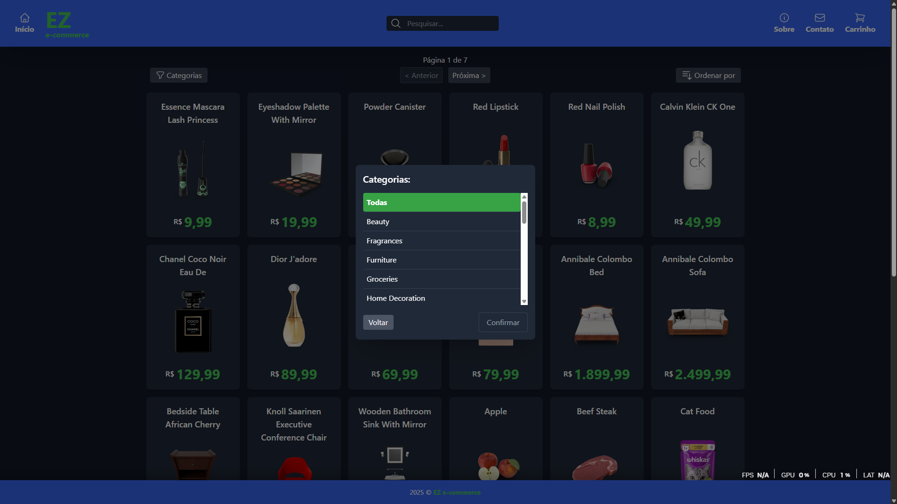

# Projeto:
EZ e-commerce

## Descrição:
Esse projeto é uma aplicação web para exibir produtos,
permitindo listar, buscar, ordenar e navegar entre categorias.
Também possui detalhes do produto e carrinho de compras.

## Funcionalidades:
- Listagem de produtos com paginação; (FUNCIONAL)
- Busca e filtro por categorias; (FUNCIONAL)
- Visualização dos detalhes de cada produto; (FUNCIONAL)
- Adição de produtos ao carrinho; (NÃO FUNCIONAL)
- Ordenação dos produtos por nome e preço (NÃO FUNCIONAL)

-------------------------------------------------------------

## Como rodar localmente:

### Pré-requisitos:
- Node.js instalado
- npm ou yarn

### Passos:
1. Clone o repositório:
git clone https://github.com/seuusuario/seuprojeto.git

2. Instale as dependências:
npm install

3. Inicie o servidor local:
npm run dev

4. Acesse no navegador:
http://localhost:3000
obs: caso a porta 3000 já esteja em uso,
o servidor pode iniciar em outra porta.
Verifique no terminal qual endereço está ativo.

-------------------------------------------------------------

## Prints das telas:
- Tela Inicial:

- Tela Sobre:

- Tela Contato:

- Tela Carrinho:

- Tela de Pesquisar:

- Tela de Categorias:

- Tela de Ordenar:

- Tela do produto:

## Vídeo demonstrativo:
Link do vídeo no YouTube,
mostrando a aplicação rodando localmente,
com explicação das principais funcionalidades:
[https://youtube.com/seuvideo](https://youtube.com/seuvideo)
